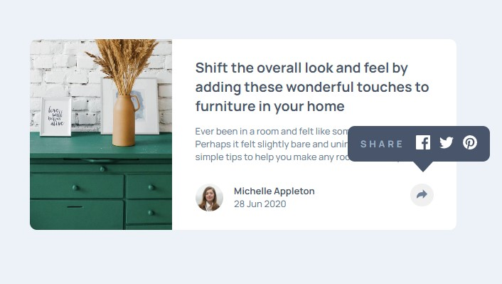
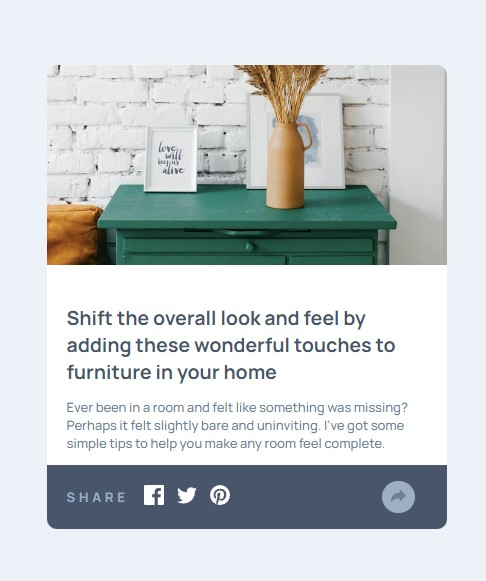

# Frontend Mentor - Article preview component solution

This is a solution to the [Article preview component challenge on Frontend Mentor](https://www.frontendmentor.io/challenges/article-preview-component-dYBN_pYFT).

## Table of contents

- [Overview](#overview)
  - [The challenge](#the-challenge)
  - [Screenshot](#screenshot)
  - [Links](#links)
- [My process](#my-process)
  - [Built with](#built-with)
  - [What I learned](#what-i-learned)
- [Author](#author)

## Overview

### The challenge

Users should be able to:

- View the optimal layout for the component depending on their device's screen size
- See the social media share links when they click the share icon
- There is different behavior for the link arrow on mobile and on wider screens.

### Screenshot

### Links

- Solution URL: [In Github](https://github.com/Jani-B/FEM-Article-preview-component)
- Live Site URL: [Github pages](https://jani-b.github.io/FEM-Article-preview-component/)

## My process

### Built with

- CSS custom properties
- Flexbox
- CSS Grid
- Mobile-first workflow
- JavaScript

### What I learned

To better use position absolute and relative. I needed to use it on the wider screen function.

- When arrow is clicked it will display the links in a "bubble" and that needed to be positioned correctly.

## Author

- Website - [Jani-B](https://www.janibergholm.com/)
- Frontend Mentor - [Jani-B](https://www.frontendmentor.io/profile/Jani-B)
